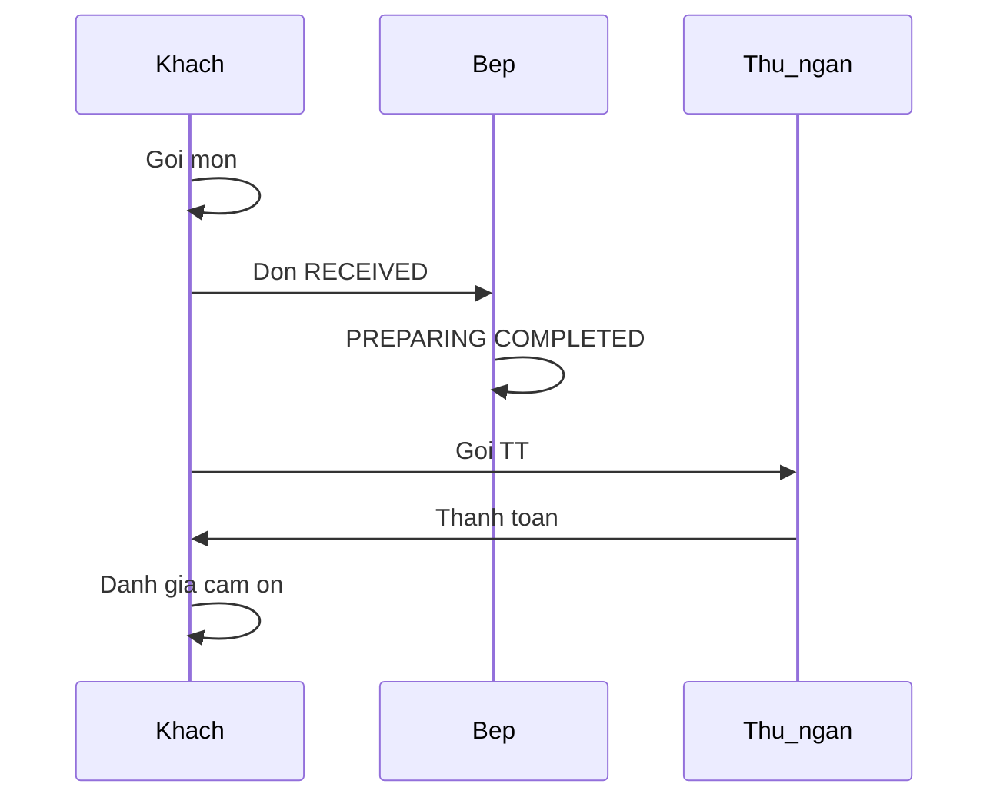

# Báo cáo dự án — Hệ thống đặt món QR (Lẩu Manwah)

## 1. Mô tả bài toán

Nhà hàng lẩu cần cho khách tự gọi món qua QR tại bàn, bếp xử lý đơn theo thứ tự, thu ngân thu tiền gộp theo bàn và thu thập đánh giá sau bữa ăn.

## 2. Vai trò sử dụng

| Vai trò | Chức năng chính |
|---------|------------------|
| Khách | Quét QR → thực đơn → gọi món → theo dõi đơn → gọi thanh toán → đánh giá |
| Bếp | Dashboard 10 bàn, xử lý đơn cũ trước, trạng thái RECEIVED → PREPARING → COMPLETED |
| Thu ngân | Bill gộp bàn, nhãn「Gọi TT」, thanh toán tiền mặt/thẻ |
| Quản lý | Hub `/admin` — vào Bếp, Thu ngân, xem Đánh giá |

## 3. Luồng nghiệp vụ

**Quy tắc quan trọng:**

- Không gọi thanh toán khi còn đơn đang ở bếp (RECEIVED/PREPARING).
- Gọi thanh toán chỉ từ trang menu; khi đã gọi TT thì khóa thêm món.
- Thu ngân thanh toán xong → khách tự chuyển trang cảm ơn và đánh giá.
- Sau đánh giá → reset session trình duyệt cho lượt khách mới.

## 4. Công nghệ

| Tầng | Công nghệ |
|------|-----------|
| Frontend | Vue 3, Vue Router, Vite, Axios |
| Backend | Node.js, Express |
| Cơ sở dữ liệu | MySQL 8 |
| Khác | qrcode (trang chủ), sessionStorage (giỏ hàng) |

## 5. Cấu trúc CSDL (rút gọn)

- `tables`, `categories`, `menu_items`
- `orders`, `order_items`, `payments`
- `table_payment_requests` — yêu cầu thanh toán theo bàn
- `service_ratings` — đánh giá sau bữa

## 6. Hạn chế

- Chưa đăng nhập / phân quyền admin (URL `/admin` công khai trong demo).
- Chạy chủ yếu môi trường local / LAN.
- Ảnh món: một phần dùng placeholder; có thể bổ sung file thật trong `public/menu/`.

## 7. Hướng phát triển

- PIN hoặc JWT bảo vệ `/admin`.
- Deploy HTTPS, CORS production.
- Dashboard thống kê doanh thu theo ngày.

## 8. Hướng dẫn demo

1. Backend: `cd qr-order-backend && npm run dev`
2. Frontend: `cd qr-order-frontend && npm run dev`
3. Khách: http://localhost:5173/
4. Nhân viên: http://localhost:5173/admin

Xem chi tiết smoke test trong [README.md](../README.md).
